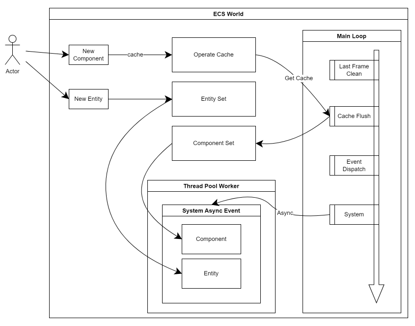
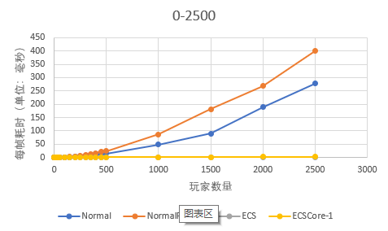
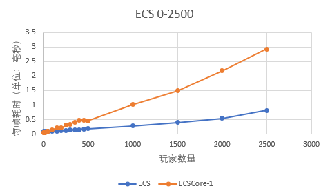
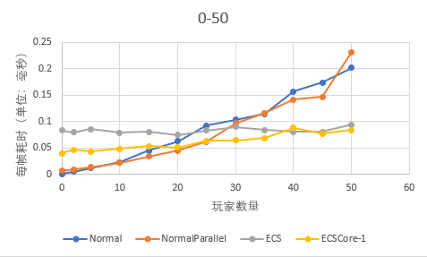

# ECS
这是一个ECS（Entity-Component-System）Go语言版本的实现，它聚焦于游戏领域的应用，帮助你快速构建一个高内聚、低耦合、易扩展、高性能的并行化游戏世界。
## Contents
* [快速开始](#快速开始)
    + [安装](#安装)
    + [简单示例](#简单示例)
* [快速了解](#快速了解)
    + [什么是ECS？](#什么是ECS？)
    + [游戏领域为什么需要ECS？](#游戏领域为什么需要ECS？)
    + [基本架构](#基本架构)
    + [基本概念](#基本概念)
        - [World](#World)
        - [Entity](#Entity)
        - [Component](#Component)
        - [System](#System)
        - [Utility](#Utility)
        - [Shape](#Shape)
        - [FixedString](#FixedString)
        - [“下一帧生效"](#“下一帧生效")
    + [设计思路](#设计思路)
* [使用教程](#使用教程)
    + [创建一个World](#创建一个World)
        - [SyncWorld](#SyncWorld)
        - [AsyncWorld](#AsyncWorld)
    - [创建一个Entity](#创建一个Entity)
    - [创建一个Component](#创建一个Component)
    - [创建一个System](#创建一个System)
        * [阶段事件](#阶段事件)
        * [阶段特征](#阶段特征)
    + [使用Utility与System交互](#使用Utility与System交互)
    + [ECS与外围系统交互](#ECS与外围系统交互)
        - [SyncWorld](#SyncWorld)
        - [AsyncWorld](#AsyncWorld)
    + [如何处理System的执行顺序](#如何处理System的执行顺序)
    + [如何选择不同类型的Component](#如何选择不同类型的Component)
        - [常规组件](#常规组件)
        - [Free组件](#Free组件)
        - [Disposable组件](#Disposable组件)
        - [FreeDisposable组件](#FreeDisposable组件)
    + [系统中获取组件的方式](#系统中获取组件的方式)
    + [系统间的数据流动](#系统间的数据流动)
    + [一个完整的例子](#一个完整的例子)
* [Benchmark](#Benchmark)
    + [测试用的代码](#测试用的代码)
    + [测试结果](#测试结果)
    + [结论](#结论)
* [API文档](#API文档)
* [设计细节](#设计细节)
    + [架构](#架构)
    + [日志](#日志)
    + [World](#World)
    + [Entity](#Entity)
    + [Component](#Component)
    + [System](#System)
    + [Utility](#Utility)
    + [Shape](#Shape)
    + [Compound](#Compound)
    + [一次Update的执行流程](#一次Update的执行流程)
    + [从添加Component到生效](#从添加Component到生效)
    + [容器](#容器)
    + [迭代器](#迭代器)
    + [协程池](#协程池)
    + [ECS序列化和反序列化](#ECS序列化和反序列化)
    + [ECS中的并行](#ECS中的并行)
    + [Entity ID的管理](#Entity ID的管理)
    + [如何行为限制](#如何行为限制)
    + [优化器](#优化器)
    + [统计器](#统计器)
* [特别注意](#特别注意)
* [存在的一些问题](#存在的一些问题)
* [写在最后](#写在最后)
* [TODO](#TODO)
## 快速开始
### 安装
```shell
go install github.com/zllangct/ecs
```
### 简单示例
这是一个不完整的示例，但可以帮助您快速了解如何在你的程序中接入和使用ecs框架。
```go
package main

import (
    "fmt"
    "github.com/zllangct/ecs"
    "time"
)

// 定义你的系统, 需要嵌套ecs.System[T]，T为你的System类型
type TestSystem struct {
	ecs.System[TestSystem]
}

// 系统Init事件
func (w *TestSystem) Init(si SystemInitializer) {
	// 申明系统感兴趣的组件, 系统内无法获取未申明的组件
	w.SetRequirements(si, &TestComponent1{}, &TestComponent2{}, &TestComponent3{})
}

func (w *TestSystem) Update(event Event) {
	// 获取系统感兴趣的组件, 作为遍历的索引，也可以叫做key组件
	iter := ecs.GetComponentAll[TestComponent1](w)
	for c := iter.Begin(); !iter.End(); c = iter.Next() {
		// 获取关联组件，他们和key组件属于同一实体，也有人称之为"兄弟组件"
		c2 := ecs.GetRelated[TestComponent2](w, c.owner)
		if c2 == nil {
			continue
		}
		
		// 一些简单的处理逻辑
		for i := 0; i < testOptimizerDummyMaxFor; i++ {
			c.Field1 += i
		}

		for i := 0; i < testOptimizerDummyMaxFor; i++ {
			c2.Field2 += i
		}
	}
}

func main() {
	// 创建一个世界需要的配置
	config := ecs.NewDefaultWorldConfig()
	// 创建一个世界
	world := ecs.NewSyncWorld(config)
	// 注册系统
	ecs.RegisterSystem[TestSystem](world)

	// 启动你的世界
	world.Startup()

	// 为你的世界添加实体
	entities := make([]Entity, count)
	for i := 0; i < count; i++ {
		e1 := world.NewEntity()
		e1.Add(&TestComponent1{}, &TestComponent2{}, &TestComponent3{})
		entities[i] = e1.Entity()
	}

	// 持续更新你的世界
	for {
		world.Update()
		time.Sleep(time.Second)
	}
}
```
示例中的 ```__world_Test_S_1``` ```__world_Test_C_1```为系统和组件，后面会详细介绍，完整的代码请移步 [ world_test.go ](./world_test.go)。
## 快速了解
### 什么是ECS？
ECS是Entity-Component-System的缩写，它是一种数据驱动的架构，它将数据和逻辑分离开来，使得数据和逻辑可以独立的扩展和复用。   
* 实体：实体代表通用对象。例如，在游戏引擎上下文中，每个粗制游戏对象都表示为实体。通常，它仅由一个唯一的ID组成。实现通常为此使用普通整数。  
* 组件：组件将实体标记为具有特定方面的标签，并保留建模该方面所需的数据。例如，每个可能造成伤害的游戏对象都可能具有与其实体相关的健康组件。实现通常使用结构，类或关联阵列。  
* 系统：系统是一个过程，可用于所有具有所需组件的实体。 例如，物理系统可能会查询具有质量，速度和位置成分的实体，并迭代对每个实体的组件集进行物理计算的结果。 

实体的行为可以在运行时由添加、删除或修改组件的系统更改。 这消除了在面向对象编程技术中难以理解、维护和扩展的深层和广泛继承层次结构的模糊问题。
常见的ECS方法与面向数据的设计技术高度兼容，并经常与之结合。 一个组件的所有实例的数据通常一起存储在物理内存中，这使得在多个实体上操作的系统能够有效地访问内存。  
(来源：[维基百科](https://en.wikipedia.org/wiki/Entity_component_system))
### 游戏领域为什么需要ECS？
总结起来大概是两个词：”瓶颈“和”契合“。  
&emsp;&emsp;此处我们忽略一些ECS的其他特性，比如解耦、易扩展等，在其他设计模式下也能够实现，这不是ECS的显著特点和优势。同时也应该提到，ECS并不是万能的灵丹妙药，
并不能解决通用编程的所有问题，作为一种设计思路，能够很好的解决一些特定的问题，就已经足以促使我们学习和使用它。谈到“瓶颈”，首先我们来看看游戏领域遇到的一些问题，当然这不是全部，我们重点关注与ECS
相关的问题。
* 游戏属于密集型运算类应用，无论是客户端还是游戏后台都需要大量的运算，比如物理、AI、视野等相关的计算。
* 游戏对时延的要求非常高，比如FPS游戏，每一帧的渲染时间都是有限的，如果超过了这个时间，就会出现卡顿的现象。我们一直在致力于创造更低时延、更流畅的游戏体验，但是随着游戏的复杂度越来越高，计算量越来越大，
这个问题也越来越严重。虽然现在硬件资源日益强大，可以满足大部分的需求，同事可以通过分布式的计算来解决一些问题，但分布式带来的网络消耗也是非常大的，调用链路复杂后，问题更明显，分布式可以解决大计算量的问题
，但延时问题并不能有效解决。为了低延时，我们甚至常常使用“直连”的方式处理客户端和服务器之间的通讯，目的仅仅是为了rpc的消耗。除了更优秀的硬件和分布式，我们能做的还有多线程，多线程可以有效的利用多核CPU的资源，
，并通过内存进行线程间的交互，非常高效，避免了分布式中rpc的网络消耗。但是多线程会使得代码变得复杂，而且线程间的交互也会带来一些问题，比如线程安全、死锁等，甚至由于数据竞争的存在，很容易写出比单线程更低效的
多线程游戏系统。游戏系统对时序的要求非常高，多线程的异步逻辑往往很难保证正确的逻辑时序，所以通常我们的游戏服务更多的是采用单线程模式，仅仅会把耗时、逻辑独立的部分逻辑使用多线程优化，主体维持单线程。于是不能
愉快的利用分布式资源和多核资源成为了游戏领域的瓶颈。
* 游戏系统的更新，大家很熟悉的就是热更新，往往采用内嵌脚本语言的方式去实现，但代价就是性能和动态语言的缺点（同时也算是优点，矛盾总是存在的）。还有一些使用共享内存方案，将游戏系统的状态数据存放在共享内存中，
重启更新游戏后台程序后从共享内存中读取并恢复游戏状态，但对于OOP的设计模式来说，这将是一个非常复杂的过程，可能你需要一个自定义的内存分配器，因为只有这样你才能处理好共享内存的分配。可能你需要定制化你所使用
到的容器，可能需要处理恢复虚表等令人头痛的问题。还有一些序列化的方案，将游戏状态在更新前序列化并保存，更新后再反序列化并恢复状态，和共享内存方案相比，这解决了一些头疼的问题，让状态的存储和恢复变得简单了一些
，但是序列化的过程也是一个非常耗时的过程，而且序列化的数据量也是非常大的，这也是一个非常大的问题。所以游戏系统的更新也是一个非常头疼的问题。
* 在大世界的游戏世界中，单一的游戏服务器往往不能满足游戏的需求，无论用怎么样的构架方式，都避免不了游戏数据在服务器之前的迁移，不同的数据分布在不同的对象中，转移中数据的处理将是一个复杂的过程，同时也往往
会在这个环节产生很多的BUG，让你的同事和你非常头疼。  

&emsp;&emsp;刻意提到上面的一些问题，是因为我们可以通过ECS的方式去改善或者解决这些问题。上面的这些“瓶颈”我们总结一下，可以归纳为以下几点：1、怎么利用多核资源 2、怎么做到优雅更新 
3、怎么做到易于数据迁移，快速的序列化状态数据 4、怎么利用分布式资源。非ECS的方案也能通过一定的方法来解决上诉问题，但我们希望一种更简单，代价更低，甚至是更好的解决办法，我们可以逐个的分析，尝试着用ECS的方式去解决这些问题。
针对多核并行这一点，我们可以先看看ECS的特点，其中我们注意到，Component中仅有数据，一个对象的抽象，将会是拆分成不同的“数据块”分布在不同的Component中，数据是离散的，数据是边界明显的，单个System中仅是处理
改系统感兴趣Component，由此可见，数据是根据System的需求组合在一起的，组合后的数据成为System逻辑意义上的“对象”，Component是有关联的最小集合，为组合提供了更多的可能性，更灵活的复用。那么Component上的明显隔离，
System的互相独立这两点为并行创造了有利条件，因为独立的系统之间不会有数据竞争，当然System之间可能会对同一Component感兴趣，这个问题很好解决，只需要计算出系统间的组件依赖，就可以知道那些系统是可以并行的，
而这一过程可以在ECS的启动阶段完成计算，不会影响到运行时的性能。 然后利用一定的算法，系统拆分成互不依赖多批次，然后再分批次并行执行。并行的过程中由于没有数据竞争，我们完全不需要使用锁的方式去保证线程安全，
因为它们天生就是安全的，无锁化的并行将给并行带来巨大的性能提升，永远不会把大量的时间消耗在锁的竞争上，不会导致多线程比单线程性能更低的结果，所以ECS的设计模式就是天生为并行而生的。 第二点，怎么优雅的更新，上面也提到了
一些更新方案会因为系统状态的复杂性导致很难做到全量状态的存储，并恢复到更新前的状态。ECS中所有的状态即Component都是单独存储的，并且结构异常简单，是通过线性数组存储，数组是内存连续的容器，很容易做到全量的存储，所以
ECS中仅需要简单的储存所有Component的容器，这个过程非常简单，你可以直接通过二进制的形式转存到文件或者共享内存中，不需要序列化，这个过程非常高效。在恢复上，你可以简单的将二进制转换为原有的Component数组，然后ECS
系统中的所有状态就恢复了，下一次Update时，系统已经恢复如初。正是这个特性，同样适合解决第三点中提到的问题，数据分离且易于转存的特性使得数据在不同的服务器间的转移逻辑异常简单。第四点，ECS的系统是独立的，数据是界限明显的，
你可以轻易的找到独立的System和Component的组合，并将他们拆分至其他节点去运行。  
&emsp;&emsp;接下来再谈谈“契合”，ECS的数据是离散的，是有明显的边界，那么在开发中涉及到的应用中都贴合这个特性么？显然不是的，比如一套复杂的ERP管理系统，每一个API都需要访问到大量的数据，
API指间需要访问的数据间有大量的耦合，我们根本无法很好的拆分出功能独立的Component，显然这跟ECS不是那么的契合。游戏世界中往往有大量的游戏对象，并且需要高频的创建或者销毁，这在ECS中是非常廉价的操作，因为
游戏对象在ECS被抽象为Entity和一些Component，然而Entity仅仅是一个整型id，Component的添加和删除也仅仅是数组的操作，我们对Component数组中Component的顺序并不敏感，利用SwapAndRemove的方式能给组件的添加和
移除带来o(1)级别的效率，创建和销毁并不需要执行额外的逻辑，这一点非常好，我们可总结为，ECS适合大量对象频繁创建销毁的使用场景。游戏世界中虽然对象数据可能非常庞大，但是他们有着非常多的共性，比如，物理是玩家、野怪、载具他们
都有移动的功能，战斗中的对象都有伤害机制，这些都可以统一抽象成同一个Component，并使用用一个System来处理，我们知道ECS中遍历同一类型的组件是非常高效的，这一点游戏领域跟ECS是贴合的。很多游戏中都有buff机制，在ECS中
一个特定的buff可以抽象为一个Component，buff的产生和实效可以抽象为ECS中的Component的创建和销毁，非常方便。ECS提倡“组合优于继承”的设计理念，“组合”这个概念在游戏世界中也非常常见，比如，移动组件、伤害组件、敌人标签组件就
可以组合成一个简单的敌对小兵，稍作改变，我们把敌人标签换成队友标签，那么我们可以得到一个为你战斗的队友，ECS中Component的删除和新增是一个基础特性，所以你可以很轻易的完成这种基于组合的创造，而不用书写多余的逻辑。此外，
游戏世界中也是具有明显的隔离特性。至此我们可以总结一下游戏世界与ECS的显著契合点, 当然列举的可能并不全面：1、大量对象 2、频繁创建销毁 3、共性行为，比如移动、伤害、buff机制 4、组合在游戏中的抽象优势 5、明确的数据隔离特性
### 基本架构

### 基本概念
ECS的整体方向是明确的，但是根据不同的ECS实现，会有一些细节上的差异，比如，命名上的差异，Component存储结构上的差异，甚至可能会根据实际的需要或者开发语言的原因妥协一些特性或者添加一下新的特性，下面会介绍一下，我们当前框架下
的一些基本概念。
#### World
World是ECS的核心，用来存储所有的Entity和Component，并管理所有的System, 它类似于通用开发中的管理器。框架中World分为SyncWorld和AsyncWorld，根据不同的使用场景，尤其是Go语言非常轻松的写出多线程逻辑的时候，我们
在调用ECS接口时，可能是同一线程，也可能是不同的线程。如果开发的入口逻辑可以保证是同一线程，那么可以选择使用SyncWorld，如果不能，那么选用AsyncWorld，框架会自动帮你处理好ECS与外围系统的交互安全问题。举一个很常见的例子，比如
使用框架构建一个客户端系统的时候，往往会有一个明确的主线程，此时使用SyncWorld就可以了，但如果是后台服务，我们知道在Go语言的实践中，往往不同的网络消息会交由不同的线程（goroutine，轻量线程，跟协程还是有所区别，我统一叫线程）来处理，
ECS内部能够很好的处理多线程，但是ECS外部的调用，需要由开发者去控制，此时选择AsyncWorld就可以了，AsyncWorld与SyncWorld的区别在于，AsyncWorld是线程安全的。
#### Entity
Entity是ECS中的基本单元，它是一个64位的整数ID，用来标识一个对象。Entity的ID由World来分配，在任意时刻，Entity的ID都是唯一的，但是不严格保证全局唯一，所以应当注意使用途中不应该用Entity代替UID使用，原因是ID低32位被设计成可复用
，ECS系统单次运行时所申请的ID是唯一的，但重复运行后会重复。有些ECS框架会使用GUID或者使用雪花算法等来生成全局唯一的ID，但我们没有这样做，原因后续会讲到。
#### Component
Component是ECS中的数据单元，它是一个结构体，用来存储数据，每个Component都有一个唯一的类型ID，用来标识这个Component的类型，Component的类型ID由World来分配，同样的，Component的类型ID也是唯一的，但不严格保证全局唯一。
#### System
System是ECS中的逻辑单元，在其他的ECS框架实现中，可能System会简单到就是一个函数，实际上这足够满足ECS对系统的描述，但在我们的框架中，System会相对复杂一些，但是他的本质还是处理Component的逻辑，后面会介绍具体实现。
#### Utility
Utility是ECS中的工具单元，但与其他的ECS实现的不同，我们的Utility不再是公共处理函数的集合，他是System的扩展，每一个Utility都与一个特定的System绑定，我们的原则中，仅有System可以直接操作Component，Component只能被System读写，
且System总是独立的，但也总是会有例外，Utility就是这个沟通的桥梁，比如我们明确SystemA对Component1感兴趣，那么SystemA是可以光明正大获取到Component1，但其他地方无法获取到Component1，此时我们需要使用绑定在SystemA上的Utility来借助
SystemA获取Component1，并做一定的操作。Utility的作用非常简单，就是一个桥梁，系统与外界沟通的桥梁，同时也让开发者清楚的感受到各个逻辑直接的界限，突出System独立的这个概念，可以有效的让某一特定的功能内聚到同一System内，降低耦合，
这是强制的限制，但是开发者可能通过语言层面的技巧突破这个限制，但我们希望开发者能够遵守这个原则，这样可以让代码更加清晰，更加易于维护。
#### Shape
Shape是ECS中的辅助单元，用来描述一组同属同一Entity的Component，也有ECS系统称之为Archetype或Sibling, 但是在我们这里不够准确，他们描述的是同一Entity所有Component的组合，而Shape描述的是一个子集，目的是用于同时获取一组Component，
当某System的某个操作，会固定操作同一Entity的一组组件时，建议使用Shape单元, 通过Shape对象可以获取到Component组迭代器，实现了类似Filter的功能，但我们不准备提供完整的Filter体系，因为我们尽可能不做过于复杂的筛选，API一旦提供
就避免不了滥用，当确有需要的时候，通过遍历实现，也非常简单。我们的筛选机制是通过系统Requirement的组合和Shape完成。
#### FixedString
FixedString是一个固定长度的字符串，适用于Component中的字符串，语言内置string是引用类型，如果内存的方式转移组件，那么内置string会带来一些问题。
#### “下一帧生效"
这是一个非常重要的概念，我们的ECS框架中，对Entity的Component创建、删除操作都会在下一帧生效。
### 设计目标
* 组件使用连续内存结构，减少cpu cache-miss
* 快速索引，无遍历获取兄弟组件
* 无锁化开发流程，开发者无需考虑并发安全问题
* 并行化System
* 阶段化执行流程，ecs全执行周期包含多个阶段，如start、update、destroy等
* ecs有主线程概念
* 通过语法限制用户行为，而不是靠用户“自觉“
* 整个世界可序列化，能够根据序列化数据恢复世界
* 充分利用Tick空档期

## 使用教程
### 创建一个World
#### SyncWorld
```go
world := ecs.NewSyncWorld()
```
#### AsyncWorld
```go
world := ecs.NewAsyncWorld()
```
### 创建一个Entity
```go
// NewEntity() 创建的是一个EntityInfo类型
info := world.NewEntity()
entity := info.Entity()
```
### 创建一个Component
```go
// 创建Component时需要嵌套Component[T], T为Component的实际类型，如下面的TestComponent
type TestComponent struct {
    ecs.Component[TestComponent]
    Field1 int
    Field2 int
}
```
### 创建一个System
```go
type TestSystem struct {
	ecs.System[TestSystem]
}

// 所有系统事件都是可选的，如果不需要某个事件，可以不实现

// 系统Init事件
func (w *TestSystem) Init(sic SystemInitConstraint) {}

// 系统Start事件
func (w *TestSystem) Start(event Event) {}

// 系统PreUpdate事件
func (w *TestSystem) PreUpdate(event Event) {}

// 系统Start事件
func (w *TestSystem) Update(event Event) {}

// 系统SyncUpdate事件
func (w *TestSystem) SyncUpdate(event Event) {}

// 系统PostUpdate事件
func (w *TestSystem) PostUpdate(event Event) {}

```
我们的ECS是阶段化的执行流程，提供了丰富的阶段性事件，当然最常用的是Update事件，当需要额外控制System先后顺序的时候，可以选择合适的事件混合使用。  
#### 阶段事件
* Init
* SyncBeforeStart
* Start
* SyncAfterStart
* SyncBeforePreUpdate
* PreUpdate
* SyncAfterPreUpdate
* SyncBeforeUpdate
* Update
* SyncAfterUpdate
* SyncBeforePostUpdate
* PostUpdate
* SyncAfterPostUpdate
* SyncBeforeDestroy
* Destroy
* SyncAfterDestroy
#### 阶段特征
| 阶段事件 | 执行次数 | 执行时机              | 同步 | 异步 |
| --- |------|-------------------| --- |---|
| Init | 1    | World Init阶段      | √      | × |
| SyncBeforeStart | 1    | World Update阶段    |  √         | × |
| Start | 1    | World Update阶段          | ×          | √ |
| SyncAfterStart | N    | World Update阶段          | √          | × |
| SyncBeforePreUpdate | N    | World Update阶段  | √          | × |
| PreUpdate | N    | World Update阶段  | ×          | √ |
| SyncAfterPreUpdate | N    | World Update阶段  | √          | × |
| SyncBeforeUpdate | N    | World Update阶段     | √          | × |
| Update | N    | World Update阶段     | ×          | √ |
| SyncAfterUpdate | N    | World Update阶段     | √          | × |
| SyncBeforePostUpdate | N    | World Update阶段 | √          | × |
| PostUpdate | N    | World Update阶段 | ×          | √ |
| SyncAfterPostUpdate | N    | World Update阶段 | √          | × |
| SyncBeforeDestroy | 1    | World Destroy阶段    | √          | × |
| Destroy | 1    | World Destroy阶段    | ×          | √ |
| SyncAfterDestroy | 1    | World Destroy阶段    | √          | × |

### 使用Utility与System交互
“Component中只有数据，System只有逻辑，只有System可以操作Component”这是我们ECS设计的指导思路，当所有的输入都来源于ECS的内部，所有系统之间
都不需要通过Component以外的方式进行交互，那么一切都将会是很美好的。当通常情况下，我们的系统会越来越复杂，不可避免会打破这个规则，但是我们并不希望
破坏我们系统的独立性，逻辑的内聚性，所以我们提供了Utility来解决这个问题。Utility与System一一对应，他可以作为单例的身份存在，同时也是与System
沟通的桥梁。在[ECS与外围系统交互](#ECS与外围系统交互)中，我们列举一个常见的例子的使用场景，在开发后台系统时，网络事件收到数据包后，需要交给我们
的ECS处理，那么就需要一次沟通，将数据包安全的交给ECS，这个时候就需要Utility来配合完成这个工作。我们先看如何创建一个Utility，并与对应的系统关联。
```go
type TestUtility struct {
    Utility[TestUtility]
}

func (u *TestUtility) ChangeName(entity Entity, name string) {
	sys := u.GetSystem()
	c := ecs.GetComponent[TestComponent](sys, entity)
	if c == nil {
		return
	}
	c.Name = name
	Log.Infof("Name changed, new:%s", name)
}

func main() {
        world := ......
		
        // 获取并使用Utility
        utility, _ :=ecs.GetUtility[TestUtility](world)
        utility.ChangeName(entity, "test")
		
        ......
}
```
需要注意的是，Utility与System是一一对应的， 需要再TestSystem的Init事件中绑定Utility,当然在不需要时可省略。
```go
func (s *TestSystem) Init(si SystemInitializer) {
    // 绑定Utility
    ecs.BindUtility[TestUtility](si)
}
```
### ECS与外围系统交互
World是ECS外部系统唯一能获取到跟对象，他是外部与ECS交互的入口，World分为SyncWorld和AsyncWorld，
SyncWorld适用于同步环境，AsyncWorld适用于异步环境。通常情况下，外部系统与ECS的交互流程如下：  
&emsp;&emsp;外部-->SyncWorld/AsyncWorld-->Utility-->Component  
直接看下面的例子，可能会觉得不太好理解，根据ECS的设计，只有System能修改Component，但是我们并不能直接获取到System实例，这是有意为之，因为System处于并行状态，不能随便的被调用，
但是ECS为此设计了Utility，Utility作为System的补充和桥梁，也可以修改Component，示例中```u.ChangeName(entity, name)```正是Utility对Component的
操作，我们先忽略其内部实现。
#### SyncWorld
```go
type TestUtility struct {
	Utility[TestUtility]
}

func (u *TestUtility) ChangeName(entity Entity, name string) {
	sys := u.GetSystem()
	c := GetComponent[TestComponent1](sys, entity)
	if c == nil {
		return
	}
	old := c.Name.String()
	c.Name.Set(name)
	Log.Infof("Name changed, old: %s, new:%s", old, name)
}

func main() {
    // 获取配置并创建世界
    config := NewDefaultWorldConfig()
    world := NewSyncWorld(config)

    // 注册系统
    RegisterSystem[TestSystem1](world)

    // 启动世界
    world.Startup()

    // 添加一下测试用的实体
    entities := make([]Entity, 100)
    for i := 0; i < 100; i++ {
        e1 := world.NewEntity()
        e1.Add(&TestComponent1{}, &TestComponent2{}, &TestComponent3{})
        entities[i] = e1.Entity()
    }

    // 尝试更新世界，使实体与他们的组件生效
    world.Update()

    // 获取Utility，并调用Utility的ChangeName方法，修改实体的Name字段
    getter := world.GetUtilityGetter()
    u, ok := GetUtility[TestUtility](getter)
	if ok {
        u.ChangeName(entities[0], "name0")
    }

    // 持续更新你的世界
    for {
        world.Update()
        time.Sleep(time.Second)
    }
}
```
#### AsyncWorld
AsyncWorld与SyncWorld不同，AsyncWorld被应用于多线程环境中，具备串行化的能力。
相较于SyncWorld，AsyncWorld多了一个Sync方法，用于将异步的操作同步化。
同时AsyncWorld不在需要我们手动调用Update方法，他会自动更新，在使用SyncWorld时我们明确的清楚每次调用Update时都处于同一线程，
但是在AsyncWorld中，Update方法可能会被多个线程调用，会导致我们的ECS混乱，这也是设计AsyncWorld的主要原因。
```go
type TestUtility struct {
    Utility[TestUtility]
}

func (u *TestUtility) ChangeName(entity Entity, name string) {
    sys := u.GetSystem()
    c := GetComponent[TestComponent1](sys, entity)
    if c == nil {
        return
    }
    old := c.Name.String()
    c.Name.Set(name)
    Log.Infof("Name changed, old: %s, new:%s", old, name)
}

func main() {
    // 获取配置并创建世界
    config := NewDefaultWorldConfig()
    world := NewSyncWorld(config)

    // 注册系统
    RegisterSystem[TestSystem1](world)

    // 启动世界
    world.Startup()

    // 添加一下测试用的实体
    entities := make([]Entity, __worldTest_Entity_Count)
    world.Sync(func(gaw SyncWrapper) {
        for i := 0; i < __worldTest_Entity_Count; i++ {
            e1 := gaw.NewEntity()
            e1.Add(&__world_Test_C_1{}, &__world_Test_C_2{}, &__world_Test_C_3{})
            entities[i] = e1.Entity()
        }
    })
	
    // 获取Utility，并调用Utility的ChangeName方法，修改实体的Name字段
    time.Sleep(time.Second * 2)
    world.Sync(func(gaw SyncWrapper) {
        u, ok := GetUtility[__world_Test_U_Input](gaw)
        if !ok {
            return
        }
        u.ChangeName(entities[0], "name2")
    })
	
    for {
        time.Sleep(time.Second)
    }
}

```
### 如何处理System的执行顺序
我们的ECS中有两种方式可以控制逻辑的顺序：
* 选择合适的阶段
* 指定系统的执行顺序  

&emsp;&emsp;文档的前方我们已经提到过，ECS中的设计有16个阶段，非常丰富，足以满足绝大部分的开发需求，其中包含Sync开头的同步点阶段，非Sync开头的异步并行阶段，
详细请看[支持的阶段事件](#支持的阶段事件)。值得注意的是，当业务逻辑需要某个阶段时可以实现对应阶段的事件，不需要时无需实现。
```go
type TestSystem1 struct {
    ecs.System[TestSystem1]
}

func (s *TestSystem1) Init(si SystemInitConstraint) {
    Log.Info("TestSystem1 Init")
}

func (s *TestSystem1) Start(event Event) {
    Log.Info("TestSystem1 Start")
}

func (s *TestSystem1) Update(event Event) {
    Log.Info("TestSystem1 Update")
}

// 前缀为Sync的阶段为同步阶段，同步阶段中ECS系统单线程执行，所以所有的操作都是安全的。
func (s *TestSystem1) SyncAfterUpdate(event Event) {
    Log.Info("TestSystem1 SyncAfterUpdate")
}
```

&emsp;&emsp;当丰富的阶段任然无法满足你的需求，比如你需要在同一阶段中指定系统的执行顺序，
这时你可以在系统的注册阶段指定其顺序。先后循序为指定Order数值由小到大执行，如下面代码所以，
系统的执行顺序为：TestSystem2 -> TestSystem3 -> TestSystem1。
```go
world := NewSyncWorld(config)

// 内置顺序选项, 默认为Append
// OrderFront   Order = 所有系统的前面
// OrderAppend  Order = 所有系统的后面

// 你可以使用的顺序是： 0-99999999
RegisterSystem[TestSystem1](world, Order(150))
RegisterSystem[TestSystem2](world, Order(5))
RegisterSystem[TestSystem3](world, Order(100))
```

### 如何选择不同类型的Component
#### 常规组件
正常情况下，我们的数据都属于正常组件这一类，比如玩家的位置、等级、血量等，这些数据会伴随实体的全生命周期, 知道实体被销毁。
类于Buff这样的组件，不会伴随实体全生命周期，但会持续一段时间，也可以视作常规组件。常规组件的定义方式：
```go
type Position struct {
    ecs.Component[Position]
    X float32
    Y float32
    Z float32
}

type HP struct {
    ecs.Component[HP]
    Value int32
}
```
#### Free组件
Free组件是特殊的组件之一，它不会被添加到实体中，它游离态的组件，通常可作为一些临时数据的载体与多个系统共享。典型的用法是将Free组件
作为系统间共享数据的“队列”，比如，客户端通过网络上行的移动指令，在实际的开发中往往需要将这些指令缓存起来，多个指令同时处理。
```go
type MoveCommand struct {
    ecs.FreeComponent[MoveCommand]
    ...
}
```
#### Disposable组件
Disposable组件特殊的组件之一，它是一次性组件，会在每帧结束后清理。假设我们需要获取新增的Entity，可以在创建Entity时，同时添加Disposable组件，
在Update中获取该Disposable组件集合，从而获取新增的Entity。Disposable组件
会在每一帧被清空，可以活的当做一次性tag使用。
```go
type TagNew struct {
    ecs.DisposableComponent[TagNew]
    ...
}
```
#### FreeDisposable组件
FreeDisposable组件是Free组件与Disposable组件的结合体，它是一次性的游离态组件，会在每帧结束后清理。
```go
type FreeDisposable struct {
    ecs.FreeDisposableComponent[FreeDisposable]
    ...
}
```
### 系统中获取组件的方式
获取Component是System中最常用的操作, 获取和遍历Component的效率是评价ECS框架优良最重要的指标之一，是ECS框架设计的核心和重心。
我们的ECS框架提供了非常高效的获取和遍历Component的操作，做到了寻址级别的查询效率，同时连续内存的存储方式，使得遍历Component的性能也非常优秀。
我们提供了两种方式获取和筛选Component。
* 通过 GetComponent 获取指定Entity的指定Component
```go
c := ecs.GetComponent[TestComponent1](entity)
```
* 通过 GetComponentAll和GetRelated获取主要组件和其关联组件。
```go
type TestSystem1 struct {
    ecs.System[TestSystem1]
}

func (s *TestSystem1) Init(si SystemInitConstraint) {
    // 设置系统感兴趣的组件
    s.SetRequirements(si, &TestComponent1{}, &TestComponent1{}, &TestComponent1{})
}

func (s *TestSystem1) Update(event Event) {
    Log.Info("TestSystem1 Update")

    iter := ecs.GetComponentAll[TestComponent1](w)
    for c := iter.Begin(); !iter.End(); c = iter.Next() {
        c2 := ecs.GetRelated[TestComponent2](w, c.owner)
        if c2 == nil {
            continue
        }
		
        c.Field1 += 1
        c.Field2 += 1
    }
}
```
* 通过 Shape同时获取兄弟组件, 这种方式非常方便的获取到同一Entity的多个Component，但不如第一种方式灵活。
```go
type Shape1 struct {
    TestComponent1 *TestComponent1
    TestComponent2 *TestComponent2
    TestComponent3 *TestComponent3
}

type TestSystem1 struct {
    ecs.System[TestSystem1]
	shp *ecs.Shape[Shape1]
}

func (s *TestSystem1) Init(si SystemInitConstraint) {
    // 设置系统感兴趣的组件
    s.SetRequirements(si, &TestComponent1{}, &TestComponent1{}, &TestComponent1{})
    // 初始化ShapeGetter
    s.shp = NewShape[Shape1](si)
}

func (s *TestSystem1) Update(event Event) {
    Log.Info("TestSystem1 Update")

    iter := s.shp.Get()
    for shp := iter.Begin(); !iter.End(); shp = iter.Next() {
        c.TestComponent1.Field1 += 1
        c.TestComponent2.Field1 += 1
        c.TestComponent3.Field1 += 1
    }
}
```
### 系统间的数据流动
（努力完善中）
### 一个完整的例子
（努力完善中）
## Benchmark
性能测试是评价ECS框架优良最重要的指标之一，设计完善的对比方案尤为重要，尽可能遵循单一变量原则，我们的框架目前欠缺完善的性能对比体系，
我们会在后续的开发中逐渐的完善。我们会首先通过一些简单的性能测试用例来说明一些问题。  
&emsp;&emsp;首先确定我们的对比思路，我们会使用OOP的方式写一段足够简单的逻辑作为负载，使用ECS的方式重写同样的逻辑，尽可能保证
处理负载的一致性。首先我们简单展示一下两种不同方式的主要代码逻辑，确保测试用例的正确的。
### 测试用的代码

首先我们先看看数据层的抽象，我们定义了Player对象，其中包含了一些基本的属性，比如生命值，攻击力，防御力等，以及一些
测试变量Test1-Test10, 在ECS中我们将这些基本属性抽象为Component。
```go
// OOP
type Player struct {
    ID                 int64
    X                  int
    Y                  int
    Z                  int
    V                  int
    Dir                [3]int
    HP                 int
    AttackRange        int
    PhysicalBaseAttack int
    Strength           int
    CriticalChange     int
    CriticalMultiple   int
    ActionType         int
    Test1              int
    Test2              int
	
	...
	
    Test10             int
}
// ECS
type Position struct {
    ecs.Component[Position]
    X int
    Y int
    Z int
}

type Movement struct {
    ecs.Component[Movement]
    V   int
    Dir [3]int
}

type HealthPoint struct {
    ecs.Component[HealthPoint]
    HP int
}

type Force struct {
    ecs.Component[Force]
    AttackRange        int
    PhysicalBaseAttack int
    Strength           int
    CriticalChange     int
    CriticalMultiple   int
}

type Action struct {
    ecs.DisposableComponent[Action]
    ActionType int
}

type Test1 struct {
    ecs.Component[Test1]
    Test1 int
}

    ...

type Test10 struct {
    ecs.Component[Test10]
    Test10 int
}
```
接着我们看看我们的一些数据的处理逻辑。
```go
// 1. 处理玩家的移动
// OOP
func (g *GameNormal) DoMove(delta time.Duration) {
    for _, p := range g.players {
        p.X = p.X + int(float64(p.Dir[0]*p.V)*delta.Seconds())
        p.Y = p.Y + int(float64(p.Dir[1]*p.V)*delta.Seconds())
        p.Z = p.Z + int(float64(p.Dir[2]*p.V)*delta.Seconds())
    }
}
// ECS
func (m *MoveSystem) Update(event ecs.Event) {
    delta := event.Delta
    iter := ecs.GetComponentAll[Movement](m)
    for move := iter.Begin(); !iter.End(); move = iter.Next() {
        entity := move.Owner()
        pos := ecs.GetRelated[Position](m, entity)
        if pos == nil {
            continue
        }
        pos.X = pos.X + int(float64(move.Dir[0]*move.V)*delta.Seconds())
        pos.Y = pos.Y + int(float64(move.Dir[1]*move.V)*delta.Seconds())
        pos.Z = pos.Z + int(float64(move.Dir[2]*move.V)*delta.Seconds())
    }
}

// 2. 处理玩家的互相攻击行为，这里我们假设玩家每帧互相攻击一次
// OOP
func (g *GameNormal) DoDamage() {
    for _, caster := range g.players {
        for _, target := range g.players {
            if caster.ID == target.ID {
                continue
            }

            //计算距离
            distance := (caster.X-target.X)*(caster.X-target.X) + (caster.Y-target.Y)*(caster.Y-target.Y)
            if distance > caster.AttackRange*caster.AttackRange {
                continue
            }

            //伤害公式：伤害=（基础攻击+力量）+ 暴击伤害， 暴击伤害=基础攻击 * 2
            damage := caster.PhysicalBaseAttack + caster.Strength
            critical := 0
            if rand.Intn(100) < caster.CriticalChange {
                critical = caster.PhysicalBaseAttack * caster.CriticalMultiple
            }
            damage = damage + critical
            target.HP -= damage
            if target.HP < 0 {
                target.HP = 0
            }
        }
    }
}
//ECS
func (d *DamageSystem) Update(event ecs.Event) {
    casterIter := d.casterGetter.Get()
    targetIter := d.targetGetter.Get()
    count := 0
    for caster := casterIter.Begin(); !casterIter.End(); caster = casterIter.Next() {
        count++
        for target := targetIter.Begin(); !targetIter.End(); target = targetIter.Next() {
            if caster.Action.Owner() == target.HealthPoint.Owner() {
                continue
            }

            //计算距离
            distance := (caster.Position.X-target.Position.X)*(caster.Position.X-target.Position.X) +
            (caster.Position.Y-target.Position.Y)*(caster.Position.Y-target.Position.Y)
            if distance > caster.Force.AttackRange*caster.Force.AttackRange {
                continue
            }

            //伤害公式：伤害=（基础攻击+力量）+ 暴击伤害， 暴击伤害=基础攻击 * 2
            damage := caster.Force.PhysicalBaseAttack + caster.Force.Strength
            critical := 0
            if rand.Intn(100) < caster.Force.CriticalChange {
                critical = caster.Force.PhysicalBaseAttack * caster.Force.CriticalMultiple
            }
            damage = damage + critical
            target.HealthPoint.HP -= damage
            if target.HealthPoint.HP < 0 {
                target.HealthPoint.HP = 0
            }
        }
    }
}

// 3. 模拟的一些其他负载， 1-10, 省略无差别的多个
// OOP
func (g *GameNormal) SimuLoad1() {
    for _, p := range g.players {
        for i := 0; i < DummyMaxFor; i++ {
            p.Test1 += 1
        }
    }
}
// ECS
func (t *Test1System) Update(event ecs.Event) {
    iter := ecs.GetComponentAll[Test1](t)
    for c := iter.Begin(); !iter.End(); c = iter.Next() {
        for i := 0; i < DummyMaxFor; i++ {
            c.Test1 += i
        }
    }
}
```
上面是列举的OOP和ECS的数据模型和处理逻辑，我们可以看到，OOP模式下是单线程模型，而ECS是多线的，
所以我们再次添加了OOP的多线程版本，有数据读写竞争的部分我们使用互斥锁保证线程安全，没有数据竞争的部分
我们不使用锁，尽可能模拟真实场景下对多线程的优化。另外我们也希望看到单线程下ECS的表现，所以另一测试用例中
我们会使用```runtime.GOMAXPROCS(1)```来限制线程的数量，模拟单线程环境。看看我们的测试用例：
```go
func BenchmarkNormal(b *testing.B) {
	game := &GameNormal{
		players: make(map[int64]*Player),
	}
	game.init()
	
	b.ResetTimer()

	var delta time.Duration
	var ts time.Time
	for i := 0; i < b.N; i++ {
		ts = time.Now()
		game.doFrame(false, uint64(i), delta)
		delta = time.Since(ts)
	}
}

func BenchmarkNormalParallel(b *testing.B) {
	game := &GameNormal{
		players: make(map[int64]*Player),
	}
	game.init()
	
	b.ResetTimer()

	var delta time.Duration
	var ts time.Time
	for i := 0; i < b.N; i++ {
		ts = time.Now()
		game.doFrame(true, uint64(i), delta)
		delta = time.Since(ts)
	}
}

func BenchmarkEcs(b *testing.B) {
	game := &GameECS{}
	config := ecs.NewDefaultWorldConfig()
	config.Debug = false
	game.init(config)
	game.world.Startup()

	b.ResetTimer()

	var delta time.Duration
	_ = delta
	var ts time.Time
	for i := 0; i < b.N; i++ {
		ts = time.Now()
		game.attack()
		game.world.Update()
		delta = time.Since(ts)
	}
}

func BenchmarkEcsSingleCore(b *testing.B) {
	// 设置使用单核心
	runtime.GOMAXPROCS(1)

	game := &GameECS{}
	config := ecs.NewDefaultWorldConfig()
	config.Debug = false
	config.CollectionVersion = 1
	game.init(config)
	game.world.Startup()

	b.ResetTimer()

	var delta time.Duration
	_ = delta
	var ts time.Time
	for i := 0; i < b.N; i++ {
		ts = time.Now()
		game.attack()
		game.world.Update()
		delta = time.Since(ts)
	}
}
```
### 测试结果
我们可以从测试代码中看到代码的时间复杂度是O(n^2)，随着玩家数量的增加，各个系统的耗时也会呈指数级增长，
我们希望看到随着玩家数量的增加，OOP和ECS的性能表现。下面我们先设置参数为```	PlayerCount = 500
DummyMaxFor = 100```，初步看看他们的表现：
```go
goos: windows
goarch: amd64
pkg: test_ecs_m_d
cpu: Intel(R) Xeon(R) W-2133 CPU @ 3.60GHz
BenchmarkNormal
BenchmarkNormal-12                   100          10050211 ns/op
BenchmarkNormalParallel
BenchmarkNormalParallel-12            57          19144577 ns/op
BenchmarkEcs
BenchmarkEcs-12                     6835            176121 ns/op
BenchmarkEcsSingleCore
BenchmarkEcsSingleCore-12           2406            528690 ns/op
testing: BenchmarkEcsSingleCore-12 left GOMAXPROCS set to 1
PASS
```
上面的结果是Go语言Benchmark给出的结果，其中主要的结论数据是我们测试用例统计的每帧耗时。暂时先不做分析，仅仅是有个直观的感受。
下面我们会调整参数```PlayerCount```, 使它从0开始递增，得到对应的原始数据：


为了方便的对比分析，我们将结果数据曲线化：



这是玩家数量从0-2500得到的曲线，OOP的方式是指数级增长，但是ECS已经无法肉眼分辨其趋势，我们单独看看ECS的曲线：



可以看到ECS仍是增长趋势，很难看出其指数趋势，接近于线性增长。曲线中无法看到玩家数量较低的性能情况，我们看看0-50区间的曲线：



### 结论
所有结论均基于上面的数据，我们可以得出以下让人惊喜的结论：
* 整体上，我们ECS性能远远大于OOP的方式，玩家数量越多，性能差距越大，玩家数据达到1000后，ECS的性能高出OOP的2个数量级(k x 100)。
* ECSCore-1 与 Normal 对比， 同为单线程，玩家数量1000时，ECSCore-1的性能高出Normal的1个数量级(k x 10)，玩家数量2500左右时
高出2个数量级。
* 同为OOP方式，单线程下性能高于多线程，其原因是多线程下，需要频繁的加锁解锁，导致性能下降，这也是游戏后台通常采用单线程的原因之一。
* 当玩家数量为0时，ECS的耗时远高于OOP方式，说明ECS框架的框架部分消耗大于OOP方式，但是随着玩家数量的增加，这个框架耗时并未增加，
说明框架的消耗是一个固定值。
* 0-50区间，由于ECS的固定系统消耗，0-25区间ECS性能低于OOP方式，25以后ECS性能大于OOP方式，但注意“25”不是固定阈值，应该是由测试代码
执行环境的物理机性能决定。

**完整代码**请移步： [ example/benchmark ](./example/benchmark-0)

## API文档
（努力完善中）
## 设计细节
（努力完善中）
### 架构
（努力完善中）
### 日志
（努力完善中）
### World
（努力完善中）
### Entity
* Entity复用
* 不保证全局唯一
* Entity的ID是一个64位的整数，高32位是世界ID，低32位是EntityID，这样设计的目的是为了支持多个世界的存在，比如，我们可以在一个世界中创建一个Entity，然后把这个Entity
### Component
（努力完善中）
### System
（努力完善中）
### Utility
（努力完善中）
### Shape
（努力完善中）
### Compound
（努力完善中）
### 一次Update的执行流程
（努力完善中）
### 从添加Component到生效
（努力完善中）
### 容器
* unordered_set
* sparse_array
* ordered_int_set
### 迭代器
（努力完善中）
### 协程池
（努力完善中）
### ECS序列化和反序列化
（努力完善中）
### ECS中的并行
（努力完善中）
### Entity ID的管理
（努力完善中）
### 如何行为限制
* 通过状态量，限制某些API的访问时期，比如某些API只能在初始化阶段执行，否则将收到错误警告
* 通过guard参数，某些API的调用需要接受一个guard参数，guard参数的作用域受到框架的限制，比如在System的Init事件中
, guard生命周期为Init事件的执行周期，Init执行结束，guard参数失效，传递、转存无法维持guard参数的有效性，因此限制
了某些API仅能在特定的事件中被调用。（需要补充实现细节代码介绍）
### 优化器
* 优化器的作用，尽可能使得ecs框架内部的数据结构尽可能连续，减少cpu cache-miss
* 优化器工作时间点，tick驱动时，利用每次update的富裕时间进行优化工作
* 优化器工作内容，对于每个Component的数据结构，进行连续化优化
### 统计器
* 统计器的内容，统计ecs框架内部的运行状态，比如每个System的执行时间，每个Component的内存占用等
* 作用，帮助开发期调试、性能优化，配合优化器完整优化工作
## 特别注意
* 重复添加Component，会失败
* 同一帧内，多次移除、添加、移除...操作只会保留最终结果，因为“下一帧生效”会丢失中间过程，即使不会丢失，也没有实际的意义，建议避免这样的操作。
* Component所有成员变量都应该是值类型，string是引用类型，需要字符串类型时请使用 框架内的FixedString类型。
## 存在的一些问题
* 稀疏数组的内存占用问题
* EntityInfo的修改需要再同步点进行
* 不支持不对等tick，不存在多层次tick，比如A系统tick间隔50ms，B系统tick间隔30ms
* 并行时task的拆分粒度固定，不支持动态调整，优化器实现后，可以根据优化器的结果，动态调整task的拆分粒度
* 并行退化，当开发者的系统依赖混乱，会导致系统关联度过高，框架调度时，会将有数据竞争的系统放到同一个线程中执行，从而导致并行退化，
最糟糕的情况是，退化为单线程系统
* 行为限制的缺失，由于golang语言的特性，无法严格得按照ECS的设计思路限制开发者的行为，开发者必须对数据驱动有一定的了解，无法严格
的使用语法规避潜在的危险行为
## 写在最后
欢迎大家提出宝贵意见，帮助完善ecs框架，这是一个长期和持续的过程，有不足或错误的地方，欢迎指正，欢迎PR。

## TODO
* [ ] 优化器实现
* [ ] 统计器完善
* [ ] 代码覆盖率
* [ ] world序列化
* [ ] 更新Atomic
* [ ] 测试用例混乱
* [ ] Example FakeGame 暂不可用

